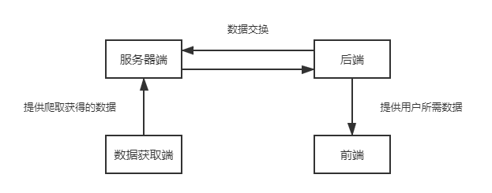
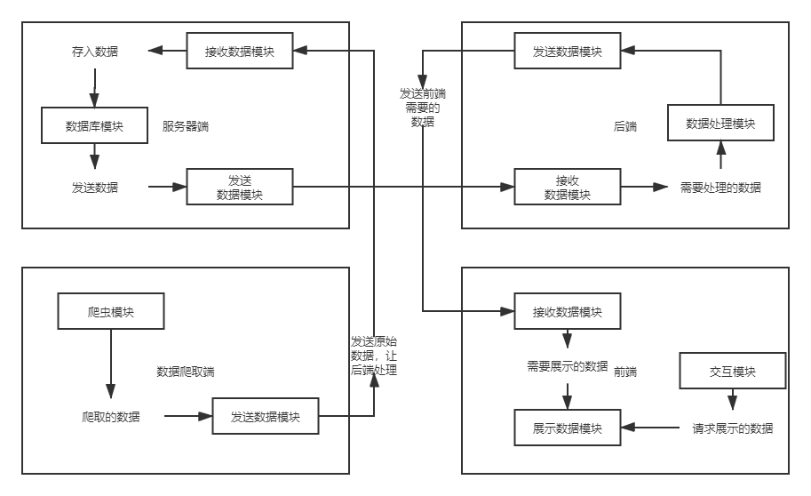

# 技术规格说明书

| 项目                 | 内容                                                         |
| -------------------- | ------------------------------------------------------------ |
| 这个作业属于那个课程 | [2021春季学期软件工程（罗杰、任健）](https://edu.cnblogs.com/campus/buaa/BUAA_SE_2021_LR) |
| 这个作业的要求在哪里 | [团队项目-计划](https://edu.cnblogs.com/campus/buaa/BUAA_SE_2021_LR/homework/11943) |
| 更新日期             | 2021年4月21日                                                |
| 描述                 | 补充了数据库和API接口设计                                    |
| 更新人               | LQ                                                           |
| 版本号               | 1.2                                                          |

## 一、技术栈

#### 1.1 前端使用的编程语言及框架

前端所使用的编程语言为HTML, CSS和JavaScript语言。

前端框架使用Vue框架。

Vue框架的优点：

* 官方文档清晰，易于上手
* Vue.js通过简单的API提供高效的数据绑定和灵活的组件系统
* 数据双向绑定，即当数据发生变化的时候，视图也就发生变化，当视图发生变化的时候，数据也会跟着同步变化。尤其是在进行**表单处理**时，Vue的双向数据绑定非常方便

#### 1.2 后端使用的编程语言及框架

后端所使用的编程语言为Python（主要因为有爬取数据的核心需求），开发环境为Python3.8。

后端框架使用flask框架。flask是基于Werkzeug工具箱编写的轻量级web开发框架，它主要面向需求简单，项目周期短的小应用。和Django不同，Flask轻巧、简洁，通过定制第三方扩展来实现具体功能，且支持noSQL等新型数据库。

#### 1.3 数据库

数据库首选MySQL，版本为MySQL8.0.21

由于目前对于每日更新数据导致的数据库建表的存疑，不排除选用其他noSQL的可能（此处待定）

#### 1.4 Web引擎

Apache或者Nginx均是目前较为流行的Web引擎。目前偏向于选择Nginx，其相较于Apache具有轻量、抗并发、高度模块化的特点。

## 二、软件的总体架构

#### 2.1 包含的子系统

* 前端

  * 主要功能包含
    * 向用户展示从后端获取的疫情感染以及疫苗接种数据。
    * 与用户进行交互，向用户动态提供其他信息。

* 后端

  * 主要功能包含
    * 向前端提供用户所需数据信息。
    * 与服务器端进行数据交换。

* 服务器端

  * 主要功能包含
    * 建立数据库，存储数据获取段所爬取的特定时间数据。
    * 与后端进行数据交换。

* 数据获取端

  * 主要功能包含
    * 应用爬虫，在特定时间爬取数据源网站公布的疫情感染及疫苗接种数据。

* UML图如下

  

#### 2.2 各个子系统内部

+ 前端：
  + 接收数据模块：负责接收后端发出的数据
  + 展示数据模块：向用户展示用户要查询的数据
  + 交互模块：对用户操作进行响应的模块。
+ 后端：
  + 接收数据模块：接收来自数据库的数据
  + 处理数据模块：根据前端需要处理相应的数据
  + 发送数据模块：向前端发送其想要的数据
+ 服务器端：
  + 数据库模块：数据库所在，存储信息
  + 发送数据模块：向后端发送数据
  + 接收数据模块：接收后端的需要存储的数据
+ 数据获取端：
  + 爬虫模块：爬取自己想要的数据
  + 发送数据模块：向服务器端发送自己爬取的数据

- UML图如下

  

## 三、功能的详细设计（待补充）

## 四、数据库和API接口设计

#### 4.1 数据库设计

* 各国家/地区感染人数/感染率表

| 属性       | 类型          | 描述          |
| ---------- | ------------- | ------------- |
| time       | DATE()        | 日期          |
| areaName   | VARCHAR(size) | 国家/地区名称 |
| currentNum | BIGINT(size)  | 现存确诊人数  |
| totalNum   | BIGINT(size)  | 累计确诊人数  |
| addNum     | INT(size)     | 新增确诊人数  |
| cured      | BIGINT(size)  | 累计治愈人数  |
| totalDead  | INT(size)     | 累计死亡人数  |
| addDead    | INT(size)     | 新增死亡人数  |
| infRate    | FLOAT(size,d) | 感染率        |

* 各国家/地区接种人数/接种率表

| 属性     | 类型          | 描述          |
| -------- | ------------- | ------------- |
| time     | DATE()        | 日期          |
| areaName | VARCHAR(size) | 国家/地区名称 |
| totalNum | BIGINT(size)  | 累计接种人数  |
| addNum   | INT(size)     | 新增接种人数  |
| vacRate  | FLOAT(size,d) | 接种率        |

* 意见表

| 属性 | 类型   | 描述         |
| ---- | ------ | ------------ |
| time | DATE() | 意见接受时间 |
| text | TEXT   | 意见内容     |

注：

* 国家--地区映射以及国家/地区--人数映射由于恒定不变，若在数据库中建表则有大量不必要的查询开销，因此考虑直接存放在后端代码数据结构中

#### 4.2 接口设计

##### 前端：

| 请求方法 | 请求路径                        | 用途                               |
| :------: | ------------------------------- | :--------------------------------- |
|   GET    | /worldMapVaccine                | 请求世界地图的接种数据             |
|   GET    | /CountryMapVaccine/\<country>   | 请求某一国家的接种数据             |
|   GET    | /worldMapInfection              | 请求世界地图的感染数据             |
|   GET    | /CountryMapInfection/\<country> | 请求某一国家的感染数据             |
|   GET    | /vaccinationSiderbar            | 请求最近两天的接种数据             |
|   GET    | /infectionSidebar               | 请求最近两天的感染数据             |
|   GET    | /otherSidebar                   | 请求最近两天某地区的感染、接种数据 |
|   GET    | /vaccinationSiderbar            | 请求侧边栏显示接种数据             |
|   GET    | /infectionSidebar               | 请求侧边栏显示感染情况数据         |
|   GET    | /otherSidebar                   | 首页总体情况数据                   |
|   GET    | /wordData                       | 请求世界各国总体数据               |
|   GET    | /countryInfection/\<country>    | 请求某国家感染情况数据             |
|   GET    | /CountryVaccine/\<country>      | 请求某国家接种情况数据             |

##### 后端：

| 文件     | 名称                                           | 返回值            | 用途                                        |
| -------- | ---------------------------------------------- | ----------------- | ------------------------------------------- |
| `dao.py` | saveInfMessage(List\<InfMessage> messages)     | void              | 存储感染信息                                |
| `dao.py` | saveVacMessage(List\<VacMessage> messages)     | void              | 存储接种信息                                |
| `dao.py` | saveAdvice(String message, String time)        | void              | 存储用户意见                                |
| `dao.py` | getInfMessage(String name, String time)        | InfMessage        | 返回某地区某时间的感染信息                  |
| `dao.py` | getInfMessageInclude(String name, String time) | List\<InfMessage> | 返回该区域某时间所包含的国家/地区的感染信息 |
| `dao.py` | getVacMessage(String name, String time)        | VacMessage        | 返回某地区某时间的接种信息                  |
| `dao.py` | getVacMessageInclude(String name, String time) | List\<VacMessage> | 返回该地区某时间所包含的国家/地区的接种信息 |

## 五、系统开发目标

#### 5.1 需要完成哪些**代码编写**？

* 编写爬虫程序，爬取数据并处理
* 数据库设计的编码：根据爬取的数据设计数据库，建表并存储数据
* 后端编码：利用Flask框架搭建后台，根据展示条件和可视化要求查询数据、处理数据、转换数据格式、传输数据到前端。
* 前端web编码：设计平台web界面
* 前端可视化编码
* 云服务器部署编码

#### 5.2 需要完成哪些**单元测试**？

**对于编写的代码，均需要完成单元测试，一般是以函数或类为单位，尤其是对接口进行单元测试，具体可见接口设计部分**

#### 5.3 需要完成哪些**系统压力测试**？具体**压力指标是多少**？

目前认为需要对以下几个方面针对性做压力测试：

前端渲染速度、页面大小、数据库设计及访存速度、网站的最大并发量、响应时间、吞吐量等

模拟并发用户数，测试峰值并发数；

响应时间：90%用户的响应时间小于0.5秒

并发用户数（同时发出请求的用户数）：2000个用户

#### 5.4 需要完成那些**真实测试**？具体**测试细节是怎样的**？

大量用户同时访问网站

短时间内存在大量请求

#### 5.5 需要完成哪些**系统文档的编写**？需要**详细到什么程度**？

- 需求文档：详细明确的需求文档。对所开发软件的功能、性能、用户界面及运行环境等作出详细的说明。它是在用户与开发人员双方对软件需求取得共同理解并达成协议的条件下编写的，也是实施开发工作的基础。该说明书应给出数据逻辑和数据采集的各项要求，为生成和维护系统数据文件做好准备。

- 概要设计文档：概要设计文档包括数据库概要设计文档和软件概要设计文档，粒度较粗，可以作为软工项目的中间产物。

- 详细设计文档： 
  - 数据库设计文档： 本文档主要描述本系统包含多少个表，每个表的字段定义，表之间的约束关系。
  - 系统详细设计文档：本文档描述本系统包含那几个功能模块，每个模块包含哪几个类，类对象之间的调用关系，每个类的属性和方法定义。

- 部署文档：部署到服务器，运行环境等的详细文档

- 用户手册：本手册详细描述软件的功能、性能和用户界面，使用户对如何使用该软件得到具体的了解,为操作人员提供该软件各种运行情况的有关知识，特别是操作方法的具体细节。

-  测试计划：为做好集成测试和验收测试，需为如何组织测试制订实施计划。计划应包括测试的内容、进度、条件、人员、测试用例的选取原则、测试结果允许的偏差范围等。

- 测试分析报告：测试工作完成以后，应提交测试计划执行情况的说明，对测试结果加以分析，并提出测试的结论意见。

- 软件维护手册：主要包括软件系统说明、程序模块说明、操作环境、支持软件的说明、维护过程的说明，便于软件的维护。

-  软件问题报告：指出软件问题的登记情况，如日期、发现人、状态、问题所属模块等，为软件修改提供准备文档。

- 软件修改报告：软件产品投入运行以后，发现了需对其进行修正、更改等问题，应将存在的问题、修改的考虑以及修改的影响作出详细的描述，提交审批。