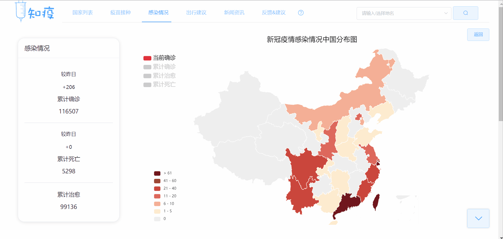
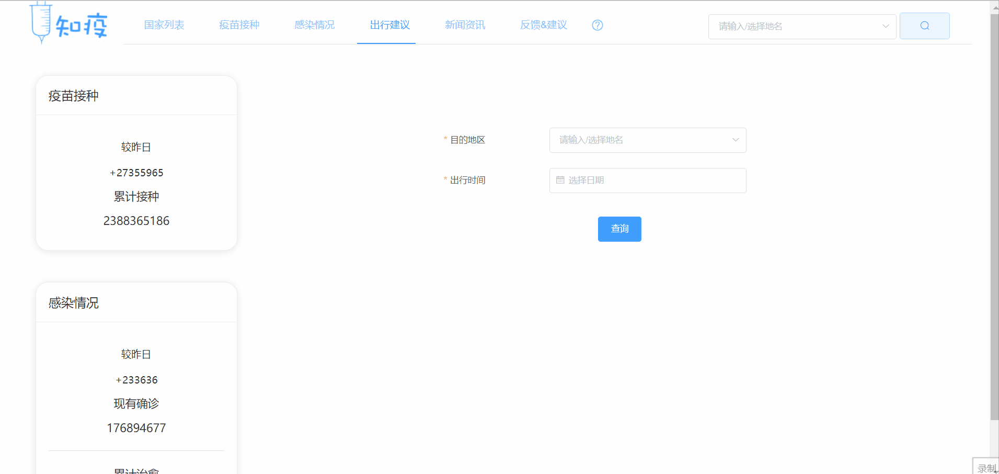
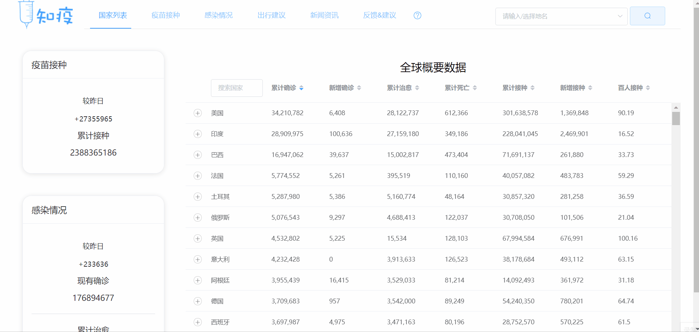
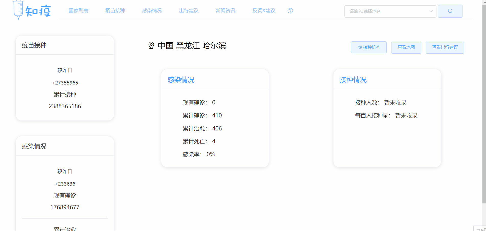
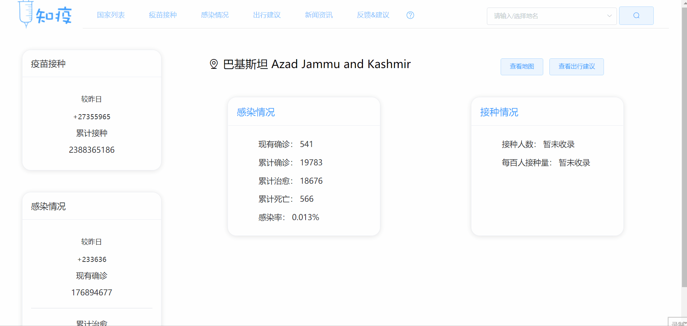
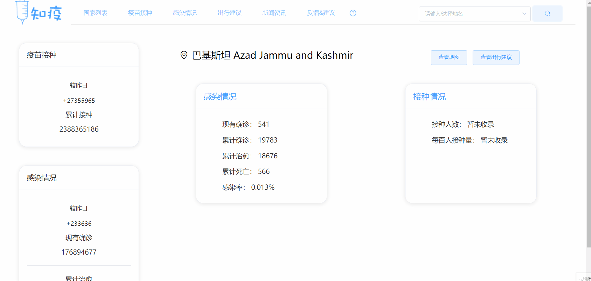

### 一、功能和特性

#### 1、各国感染及接种详情界面 折线图下拉 提示

**功能说明：**

在感染详情及接种详情界面，右下角有一个明显的下拉提示，触碰提示`查看折线图`，可以通过点击将页面**滑到底部**显示折线图

**解决的问题：**

- 用户在浏览详情界面时，可能会忽略下面的历史数据折线图，可通过这个较明显的按钮，**提示**用户下方的内容，同时帮助用户快速查看下方折线图

#### 2、出行建议

**功能说明：**

在`出行建议`界面下，系统可以根据用户选择的**目的地**与**出行时间**，给出针对性的出行建议（每天更新），包括

- 目的地的政策严格性指数
- 14天内的新增感染数
- 目的地的风险等级（国内，如存在中高风险地区，会详细列出）（每天去官方平台进行爬取）

目的地选择方式有两种：

- 通过提供的级联选择器直接进行选择

  

- 通过搜索联想进行选择

  

**解决的问题：**

- 对地区安全指数的个性化分析
- 为用户提供科学的出行建议

**应用场景：**

小明是北京的一名在校大学生， 他的家乡在广东佛山，端午节到了，他想回家去探望一下父母，但是广东最近的情况不容乐观，通过查询“知疫”平台，他清楚地了解到了广东**近14天的新增感染病例数**，并且发现佛山存在**两个中风险地区**，平台给的建议也是`如非必要不要前往`，于是他想：还是算了，等到暑假广东安全了再回家吧。

#### 3、地区详细信息搜索

**功能说明：**

通过菜单栏的搜索框，用户同样可以通过两种方式来选择地区（包括国内外的国家、国内省市），来进行搜索，过程如下：

**搜索结果**分为以下几部分：

- 疫情感染与疫苗接种信息

- 接种结构：通过点击`查看接种机构`按钮显示（只在**中国地级市**的搜索结果中显示接种机构）

  

  同时

  - 如果数据不存在，显示`暂未收录`

    

  - 如果数据存在，采用**动态加载**机制进行显示

    

- 出行建议：通过点击`出行建议按钮`跳转

  

- 疫情地图：通过点击`查看地图`跳转

  

**解决的问题：**

- 对地区的**针对性**查询，满足用户的需求
- 将某个地区的所有信息（感染接种信息、接种机构、感染地图、出行建议）集中进行显示

**应用场景：**

李四对德国的新天鹅城堡慕名已久，想趁假期去看看，准备出发之前，他打开平台搜索新天鹅城堡所在的州Bayern，看到它的感染与接种的**详细信息**，发现当前感染人数很多；而且通过查看德国的**感染地图**，也发现德国的疫情比较严重；最后，他查询平台的**出行建议**，发现出行风险为高。他有点害怕，所以决定还是先在国内旅游，等疫情过去再去德国吧。

#### 4、疫情与疫苗的新闻资讯

##### 功能说明：

在`新闻资讯`界面，通过每天对**百度新闻**进行爬取，将新闻分为`疫苗新闻`与`疫情新闻`两部分，每类显示20条，点击可链接到外部新闻网站

**解决的问题：**

- 国内外疫情资讯的展示
- 用户可快速查看疫情及疫苗最新新闻

**应用场景：**

王奶奶是一名退休人员，但是她仍然很关心国际形势与国内发展，尤其是最近新冠疫情在国内外进行蔓延，造成了大量的感染与死亡。通过”知疫“平台，她不但可以清楚地看到国内外各个地区的**可视化**感染与接种情况（人老了， 不喜欢看密密麻麻的数字），还能够每天看一会**最新**的疫情新闻，帮助她更好地了解国内外地疫情情况。

#### 5、移动端适配

##### 功能说明：

对于网页端的各种功能，我们在移动端上进行了界面适配，目前，移动端与PC端的功能表现基本保持一致

##### 解决的问题：

- 平台在移动端的显示

##### 应用场景：

王先生是一个50多岁的仍在工作岗位上奋斗的文职人员，他平常很少用到电脑，在手机上看到”知疫“平台发布的alpha宣传时，他好奇地点开了，但是眼前一片混乱：菜单栏换行、字体大小不合适、各种组件排列混乱... ...，他的体验感极差，而在”知疫“推出的Beta版本上，点开链接，页面清楚大方，排列整齐，他可以流畅地使用各种功能，体验感很棒，还实现了很多实用性的功能，他决定要把这个平台推荐给他的同事、家人和朋友。

